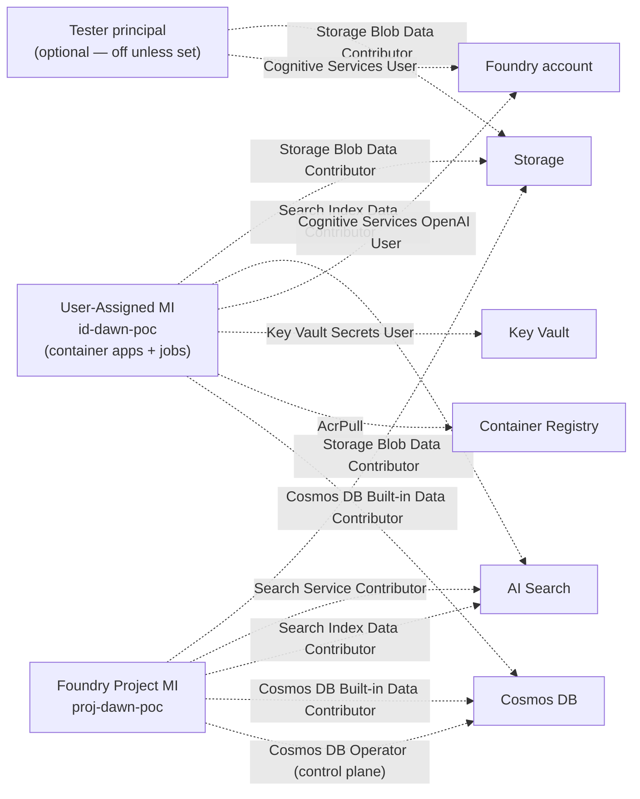
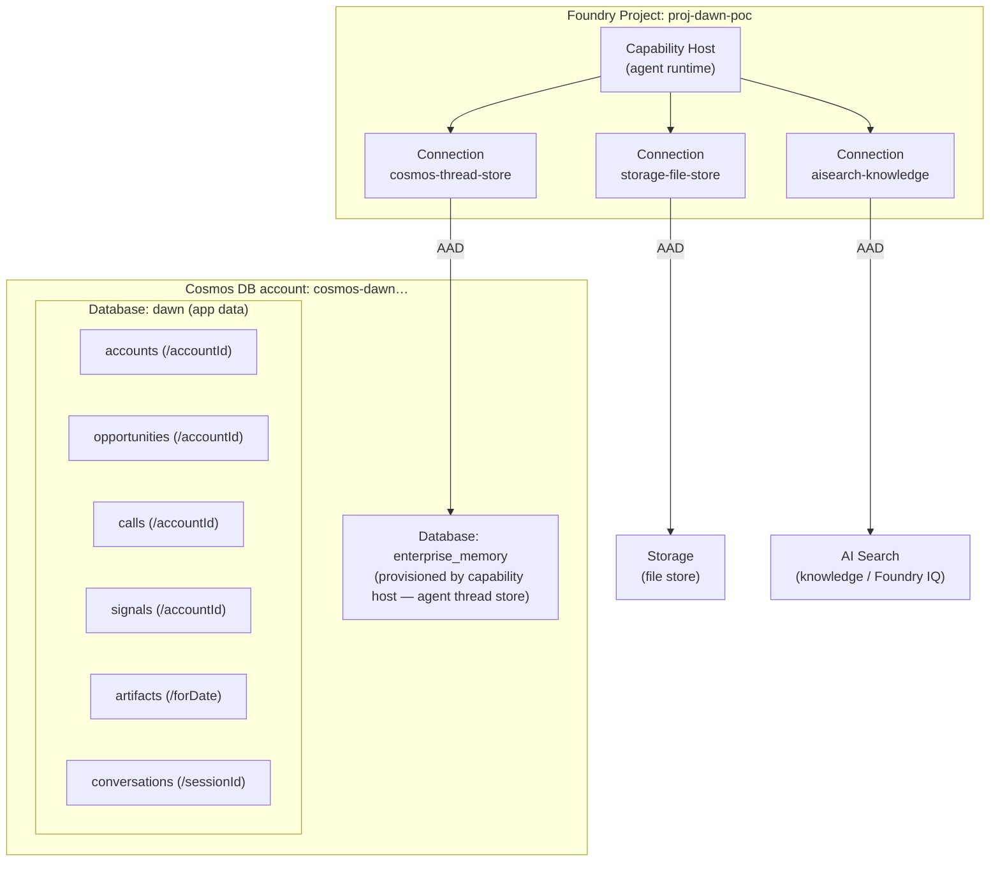

# Dawn — Deployed Infrastructure Diagram

> Grounded in the deployed Bicep (`main.bicep` + modules) as of **Wed, July 15, 2026**.
> Resource group **`rg-dawn-fsi-poc`**, region **Sweden Central**, address space **192.168.0.0/16**.
> An optional, WAF-protected public edge (Azure Front Door + EasyAuth) now fronts the `ui` app —
> shown in View 1 and detailed in `FRONTDOOR-EASYAUTH.md`.
>
> **How to view/export:** open in VS Code (Mermaid preview built in) or GitHub — both render
> these blocks as diagrams. To get an image, use the VS Code Mermaid "export" or paste a block
> into <https://mermaid.live> and download PNG/SVG. Name placeholders (`…`) stand for the
> `uniqueString` suffix Azure generates.

---

## View 1 — Network & resource topology

```mermaid
flowchart TB
  %% ---- public edge (optional; deployFrontDoor = true is the current param default) ----
  INET["Internet<br/>(public users)"]
  subgraph EDGE["Public edge — global (optional, deployFrontDoor = true)"]
    AFD["Azure Front Door (Premium)<br/>ep-dawn-poc-….azurefd.net"]
    WAFP["WAF policy (Premium)<br/>DRS 2.1 + Bot Manager 1.1<br/>+ per-IP rate-limit 100/min"]
    EAUTH["EasyAuth — Entra ID<br/>sign-in gate on ui<br/>(Phase 2 — enableEasyAuth, off)"]
  end
  subgraph RG["Resource Group: rg-dawn-fsi-poc (Sweden Central)"]
    UAMI["User-Assigned MI<br/>id-dawn-poc"]
    LAW["Log Analytics<br/>log-dawn-poc"]
    APPI["App Insights<br/>appi-dawn-poc"]
    FAB["Microsoft Fabric F4<br/>(OneLake)"]
    NATPIP["Public IP<br/>pip-nat"]
    NAT["NAT Gateway<br/>nat-vnet-dawn-poc"]

    subgraph VNET["VNet vnet-dawn-poc — 192.168.0.0/16"]
      subgraph SAGENT["snet-agent — 192.168.0.0/24 (deleg. Microsoft.App)"]
        AINJ["Foundry agent<br/>network injection"]
      end
      subgraph SPE["snet-pe — 192.168.1.0/24 (private endpoints)"]
        PEF["pe-foundry"]
        PEST["pe-storage"]
        PECOS["pe-cosmos"]
        PESR["pe-search"]
        PEACR["pe-acr"]
        PEKV["pe-keyvault"]
      end
      subgraph SACA["snet-aca — 192.168.2.0/24 (deleg. Microsoft.App)"]
        ACAENV["ACA Environment (internal)<br/>cae-dawn-poc"]
        APPS["6 Container Apps<br/>ui · stub-crm · stub-products<br/>stub-core · stub-knowledge · toolbox"]
        JOBS["4 Jobs<br/>overnight-batch (cron 0 9 * * *)<br/>seed-stubs · load-onelake · index-search"]
      end
      subgraph SBAS["AzureBastionSubnet — 192.168.3.0/26"]
        BAS["Azure Bastion<br/>(Standard)"]
      end
      subgraph SMGMT["snet-mgmt — 192.168.5.0/24"]
        JUMP["Windows Jumpbox<br/>vm-jump-dawn-poc (Entra login)"]
      end
      subgraph SAPP["snet-appsvc — 192.168.4.0/24 (optional, OFF)"]
        WEB["Web App (not deployed)"]
      end
    end

    subgraph DATA["Data services — PaaS, public access disabled"]
      ST["Storage<br/>st-dawn…"]
      COS["Cosmos DB (serverless)<br/>cosmos-dawn… · DB: dawn"]
      SR["AI Search<br/>srch-dawn…"]
      ACR["Container Registry (Premium)<br/>acr-dawn…"]
      KV["Key Vault<br/>kv-dawn…"]
    end

    subgraph AIF["Azure AI Foundry"]
      FND["Foundry account (AIServices)<br/>aif-dawn… · public access disabled"]
      PROJ["Project<br/>proj-dawn-poc"]
      CAP["Capability Host<br/>(deployed after RBAC)"]
    end

    subgraph DNS["Private DNS Zones (VNet-linked)"]
      DZ["blob · documents · search · vaultcore · azurecr<br/>openai · cognitiveservices · services.ai<br/>+ ACA env domain (wildcard → env static IP)"]
    end
  end

  %% public edge -> internal ui app via Private Link (only when deployFrontDoor = true)
  INET -->|"HTTPS"| AFD
  AFD --> WAFP
  WAFP -->|"Private Link (managedEnvironments)<br/>approved PE connection → ui origin"| ACAENV
  EAUTH -. "gates ui on every path" .-> APPS

  %% egress
  NATPIP --> NAT
  NAT -->|"SNAT egress"| ACAENV
  NAT -->|"SNAT egress"| JUMP

  %% private endpoints -> PaaS
  PEF --> FND
  PEST --> ST
  PECOS --> COS
  PESR --> SR
  PEACR --> ACR
  PEKV --> KV
  SPE -. "resolve via" .-> DNS

  %% foundry
  AINJ --- FND
  FND --> PROJ
  PROJ --> CAP

  %% access path
  BAS --> JUMP

  %% compute wiring
  ACAENV --> APPS
  ACAENV --> JOBS
  APPS -->|"pull images"| ACR
  JOBS -->|"pull images"| ACR
  APPS -->|"telemetry"| APPI
  ACAENV -->|"container logs"| LAW
  JUMP -->|"OneLake load"| FAB

  %% diagnostics (representative)
  FND -.->|"diagnostics"| LAW
  COS -.->|"diagnostics"| LAW
```

**Private endpoint ↔ DNS zone map (all in `snet-pe`):**

| Private endpoint | Target resource | Group ID | Resolves via private DNS zone |
|---|---|---|---|
| `pe-foundry` | Foundry account | `account` | `privatelink.openai.azure.com`, `…cognitiveservices.azure.com`, `…services.ai.azure.com` |
| `pe-storage` | Storage | `blob` | `privatelink.blob.core.windows.net` |
| `pe-cosmos` | Cosmos DB | `Sql` | `privatelink.documents.azure.com` |
| `pe-search` | AI Search | (search) | `privatelink.search.windows.net` |
| `pe-acr` | Container Registry | (registry) | `privatelink.azurecr.io` |
| `pe-keyvault` | Key Vault | `vault` | `privatelink.vaultcore.azure.net` |

> **Front Door origin (when `deployFrontDoor = true`):** a *shared* Private Link to the ACA managed
> environment (`groupId: managedEnvironments`) — **not** one of the `snet-pe` endpoints above. It
> creates a pending private-endpoint connection on the env that `deploy.sh` approves post-deploy, so
> the `ui` container app is reachable from the edge without ever getting a public IP.

---

## View 2 — Identity & RBAC linkages (keyless)

All access is via managed identity + Azure RBAC — no keys or connection strings. Dotted edges
are role assignments (role name on the edge).

> **Why the two Cosmos roles on the project:** the *Built-in Data Contributor* (data plane) lets
> the agents read/write items; the *Cosmos DB Operator* (control plane) lets the **capability host**
> create the `enterprise_memory` database + containers the Agents runtime provisions. Both are
> required — this was one of the deployment fixes.

---

## View 3 — Foundry agent connections & Cosmos data model

---

## Legend & notes

- **Solid arrow** = network/data path or containment. **Dotted arrow** = RBAC role assignment.
- **PaaS data services** (Storage, Cosmos, Search, ACR, Key Vault, Foundry) sit *outside* the VNet
  but are reached **only** through private endpoints in `snet-pe`; public network access is disabled
  on all of them.
- **Ingress — internal by default, optional WAF-protected public edge**: the ACA environment is
  internal; the six apps run `external: true` on it, meaning VNet-reachable via the env's internal
  load balancer — **not** directly internet-facing. When **Front Door is on** (`deployFrontDoor = true`,
  the current param default), Azure Front Door (Premium) + WAF fronts **only** the `ui` app over
  **Private Link** to the ACA environment (`groupId: managedEnvironments`) — the container app still
  has **no public IP**. **EasyAuth** (Entra ID sign-in) is an optional gate on the `ui` app, enforced
  on both the Front Door and internal paths (Phase 2 — `enableEasyAuth`, off by default). Full runbook:
  `FRONTDOOR-EASYAUTH.md`.
- **Egress**: only the NAT gateway provides outbound internet, for `snet-aca` + `snet-mgmt`
  (outbound-only SNAT, no inbound).
- **Deploy ordering (dependsOn):** `rbac` → after all data services; `capability host` & `container
  apps/jobs` → after `rbac` (so role assignments propagate first).
- **Optional:** Front Door + WAF public edge (`deployFrontDoor` — **on** in params) and **EasyAuth**
  Entra sign-in (`enableEasyAuth` — **off**, Phase 2). **Off by default:** Web App (`snet-appsvc`),
  Foundry model deployments, and the subscription-scoped Defender for Cloud add-on (`security/`).
